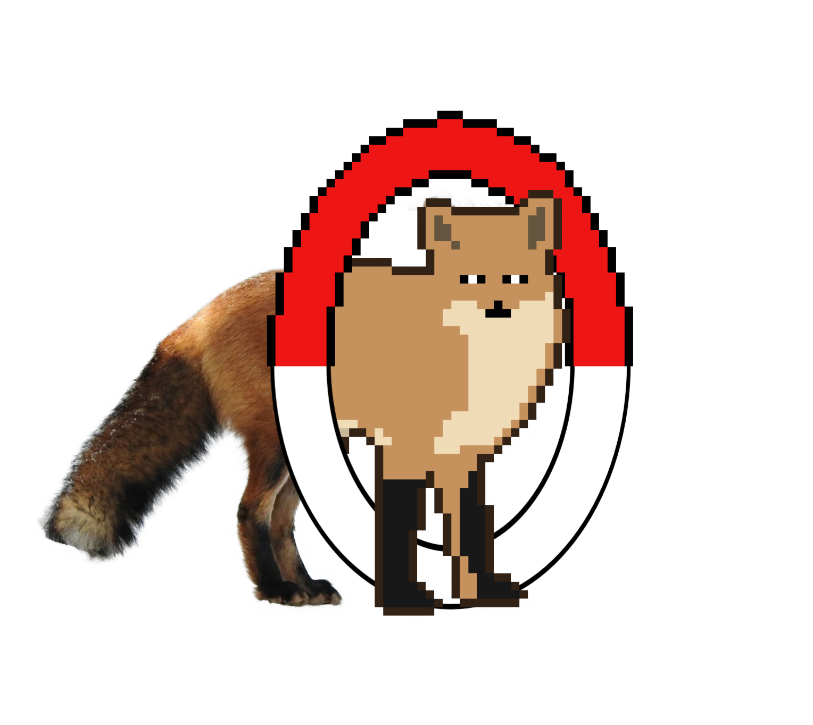

# 🦊 Foks | Taidetehtävä / Foks | Art Assignment

Foks on kuvitteellinen brändi-identiteetti, joka luotiin osana taidekurssin tehtävää. Tämä arkisto sisältää brändin visuaalisen identiteetin, graafiset ohjeet ja ladattavia materiaaleja.

Foks is a fictional brand identity created as part of an art course assignment. This archive contains the brand's visual identity, graphic guidelines, and downloadable materials.

## 📋Graafinen Ohjeisto / Graphic Instruction

Graafinen ohjeisto löytyy [täältä](https://pdflink.to/885e9faf/) tai itse GitHub-repositoriosta.

The graphical instructions can be found [here](https://pdflink.to/885e9faf/) or in the GitHub repository itself.

## 📁 Ladattavat Tiedostot / Downloadable Materials

Voit ladata kaikki graafisessa ohjeistossa näkyvät variaatiot [täältä](https://acrobat.adobe.com/id/urn:aaid:sc:AP:4d650dc2-b1c4-4193-80a5-b48e5d404508) tai itse GitHub-repositoriosta.

You can download all the variations shown in the graphic instructions [here](https://acrobat.adobe.com/id/urn:aaid:sc:AP:4d650dc2-b1c4-4193-80a5-b48e5d404508) or in the GitHub repository itself.

## 🎬 Kulissien Takana / Behind the Scenes

https://youtu.be/5i_ic1PrYz0

## ⚠️ Lisenssi / License ⚠️

Tämä suunnittelu on jaettu Creative Commons Nimeä-EiKaupallinen 4.0 Kansainvälinen -lisenssillä. Lisätietoja on osoitteessa `license.txt`.

This design is distributed under the Creative Commons Attribution-NonCommercial 4.0 International. Read `license.txt` for more information.

## Misc.

Kielimuoto / Language format: FI / EN

FI Kielimuoto

EN Language format

Made by Fyve28.

Special thanks to Nashi (my friend) for helping me out with this project \ :D /
